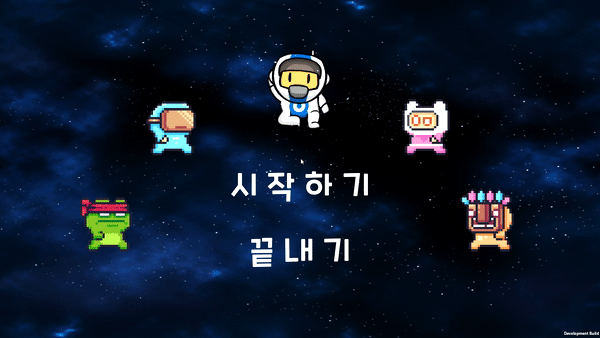
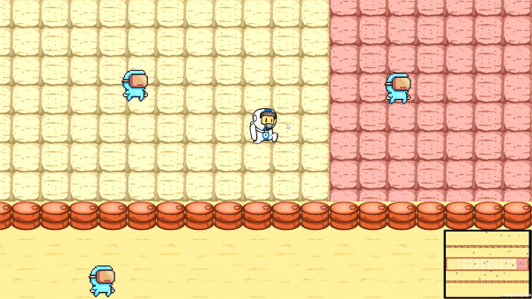

# <center>외계인 피하기</center>

<center></center>

---
<br>
<br>

# Description
귀여운 우주비행사가 외계인을 피하여 목적지에 도착하는 게임입니다.

**이 게임은 유니티를 이용한 게임 개발 첫 프로젝트입니다.**
<br>
<br>

# How to play

  
- **시작하기** 버튼을 클릭하세요.


- **방향키** (→, ←, ↑, ↓)를 이용하여 우주비행사를 움직일 수 있습니다. 


- 외계인과 부딪히면 우주비행사는 **사라집니다**. 



- 도착지점에 도착하면 **Clear** 입니다. 


- 참고로, 시작지점에서는 외계인과 부딪혀도 **사라지지 않습니다**. 


- 두 번째 스테이지는 조금 더 **어렵습니다 :)**

---
# 실행 방법
- ```mysetup.exe``` 파일을 다운받아 실행시키면 됩니다. 

# 게임 특징

- 시작 시 적을 정해진 **SpawnPoint**에서 정해진 **EnemyNum**만큼 소환
- **SpeedPeriod** 주기로 적의 이동속도와 이동방향을 랜덤으로 결정
- **Boundary**에 닿게 되면 정해진 **reSpawnPoint**로 적 위치를 조정
- 새로운 맵을 무한정 만들 수 있음 (Scene 복사 후 몇 가지 작업 필요)
- 총 4종류의 적을 만들 수 있음(데모버전에선 1가지만 등장)
- **Title** 메뉴 배경음악 랜덤 재생
- Etc..


